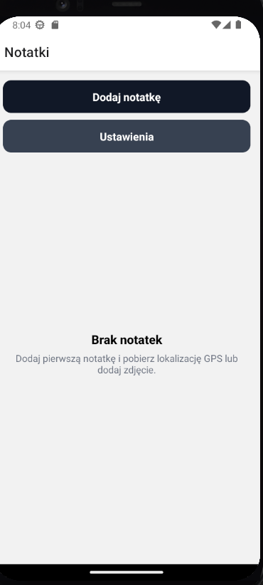

# Field Notes - React Native App

Aplikacja mobilna do tworzenia notatek terenowych z wykorzystaniem natywnych funkcji urządzenia (aparat, GPS) oraz integracji z API.

## Funkcje

### Widoki (4 ekrany)

1. **Lista notatek** (`NotesListScreen`)
   - Wyświetla wszystkie notatki z tytułem, datą i znacznikiem lokalizacji
   - Przyciski do dodawania nowych notatek i przejścia do ustawień
   - Pull-to-refresh do odświeżania listy

2. **Szczegóły notatki** (`NoteDetailsScreen`)
   - Pełny widok notatki z opisem, zdjęciem i pozycją GPS
   - Przyciski do edycji i usuwania notatki

3. **Dodaj/Edytuj notatkę** (`NoteFormScreen`)
   - Formularz z polami: tytuł, opis
   - Możliwość dodania zdjęcia z galerii
   - Możliwość pobrania aktualnej lokalizacji GPS
   - Walidacja i obsługa błędów

4. **Ustawienia** (`SettingsScreen`)
   - Informacje o aplikacji i wersji
   - Przełącznik większego tekstu (funkcja dostępności)

### Funkcje natywne

1. **Galeria** (`expo-image-picker`)
   - Wybór zdjęć z galerii urządzenia
   - Obsługa uprawnień i błędów

2. **Lokalizacja GPS** (`expo-location`)
   - Pobieranie aktualnej pozycji GPS
   - Wyświetlanie współrzędnych z dokładnością
   - Obsługa uprawnień i błędów

### Integracja z API

- **Backend**: json-server (lokalny serwer REST API)
- **Endpoint**: `http://localhost:3000` (iOS) lub `http://10.0.2.2:3000` (Android)
- **Operacje**:
  - `GET /notes` - pobieranie listy notatek
  - `POST /notes` - zapisywanie nowej notatki
  - `PUT /notes/:id` - aktualizacja notatki
  - `DELETE /notes/:id` - usuwanie notatki
- **Dane**: Przechowywane w `server/db.json`

### Dostępność

- Wszystkie przyciski mają minimum 48px wysokości (zgodnie z wytycznymi dostępności)
- Etykiety dostępności (`accessibilityLabel`, `accessibilityHint`) dla wszystkich interaktywnych elementów
- Przełącznik większego tekstu w ustawieniach
- Czytelne rozmiary czcionek i kontrasty kolorów

## Instalacja i uruchomienie

### Wymagania

- Node.js (v14 lub nowszy)
- npm lub yarn
- Expo CLI (`npm install -g expo-cli`)
- Expo Go app na telefonie (iOS/Android) lub emulator

### Kroki instalacji

1. **Zainstaluj zależności:**
   ```bash
   npm install
   ```

2. **Uruchom serwer API (json-server):**
   ```bash
   npm run server
   ```
   Serwer będzie dostępny na porcie 3000.

3. **W osobnym terminalu uruchom aplikację:**
   ```bash
   npm start
   ```
   lub
   ```bash
   expo start
   ```

4. **Opcje uruchomienia:**
   - Naciśnij `a` dla Android emulatora
   - Naciśnij `i` dla iOS simulatora
   - Zeskanuj kod QR w aplikacji Expo Go na telefonie

**Uwaga**: Aby aplikacja mogła komunikować się z API:
- Na iOS simulatorze: `http://localhost:3000` (automatycznie)
- Na Android (emulator i telefon): `http://192.168.1.3:3000` (używa IP komputera z `apiConfig.js`)

**Konfiguracja IP komputera:**
1. Znajdź IP komputera:
   - **Windows (PowerShell)**: `ipconfig` → szukaj "IPv4 Address" przy aktywnym Wi-Fi
   - **Mac/Linux**: `ifconfig` → szukaj adresu IP w interfejsie WiFi/Ethernet
   - **W Expo**: IP jest widoczne przy starcie: `exp://192.168.1.3:8081`
2. Zaktualizuj `src/utils/apiConfig.js`:
   ```javascript
   const LAN_IP = "192.168.1.3"; // Zmień na IP swojego komputera
   ```

**Rozwiązywanie problemów z połączeniem:**
1. Upewnij się, że serwer json-server jest uruchomiony (`npm run server`)
2. Sprawdź czy serwer działa, otwierając w przeglądarce: `http://localhost:3000/notes`
3. Upewnij się, że telefon i komputer są w tej samej sieci WiFi
4. Jeśli na emulatorze Android `LAN_IP` nie działa, możesz tymczasowo zmienić w `apiConfig.js` na `"http://10.0.2.2:3000"`
5. Jeśli nadal nie działa, sprawdź firewall - może blokować połączenia na porcie 3000

## Testowanie

### Testowanie podstawowych funkcji

1. **Uruchomienie serwera API:**
   ```bash
   npm run server
   ```

2. **Dodawanie notatki:**
   - Otwórz aplikację
   - Naciśnij przycisk "Dodaj notatkę"
   - Wypełnij formularz (tytuł jest wymagany)
   - Zapisz notatkę

3. **Użycie galerii:**
   - W formularzu dodawania/edycji notatki
   - Naciśnij "Dodaj zdjęcie z galerii"
   - Wybierz zdjęcie z galerii
   - Zdjęcie powinno pojawić się w podglądzie

4. **Pobieranie lokalizacji GPS:**
   - W formularzu dodawania/edycji notatki
   - Naciśnij "Pobierz GPS"
   - Zatwierdź uprawnienia lokalizacji (jeśli pierwszy raz)
   - Współrzędne GPS powinny zostać zapisane

5. **Wyświetlanie listy:**
   - Na ekranie głównym powinna być widoczna lista notatek
   - Każda notatka pokazuje: znacznik lokalizacji (📍 lub —), tytuł, datę utworzenia
   - Możesz przeciągnąć w dół, aby odświeżyć listę

6. **Szczegóły notatki:**
   - Naciśnij na notatkę w liście
   - Powinien otworzyć się ekran szczegółów z pełnymi informacjami

7. **Edycja notatki:**
   - Otwórz szczegóły notatki
   - Naciśnij "Edytuj"
   - Zmodyfikuj dane i zapisz

8. **Usuwanie notatki:**
   - Otwórz szczegóły notatki
   - Naciśnij "Usuń"
   - Potwierdź usunięcie

### Testowanie komunikacji z API

1. **Pobieranie notatek z API:**
   - Przy pierwszym uruchomieniu aplikacja pobiera notatki z API
   - Sprawdź konsolę deweloperską, czy żądania są wysyłane
   - Notatki powinny pojawić się na liście

2. **Zapisywanie do API:**
   - Utwórz nową notatkę
   - Sprawdź konsolę, czy żądanie POST zostało wysłane
   - Sprawdź plik `server/db.json`, czy notatka została zapisana
   - Notatka powinna być widoczna na liście

3. **Aktualizacja w API:**
   - Edytuj istniejącą notatkę
   - Sprawdź plik `server/db.json`, czy zmiany zostały zapisane

4. **Usuwanie z API:**
   - Usuń notatkę
   - Sprawdź plik `server/db.json`, czy notatka została usunięta

### Testowanie edge cases i błędów

1. **Brak uprawnień do galerii:**
   - Odrzuć uprawnienia do galerii
   - Spróbuj wybrać zdjęcie
   - Powinien pojawić się komunikat błędu

2. **Brak uprawnień do lokalizacji:**
   - Odrzuć uprawnienia do lokalizacji
   - Spróbuj pobrać lokalizację
   - Powinien pojawić się komunikat błędu

3. **Brak serwera API:**
   - Zatrzymaj serwer json-server
   - Spróbuj dodać/edytować notatkę
   - Powinien pojawić się komunikat błędu
   - Aplikacja powinna obsłużyć błąd gracefully

4. **Walidacja formularza:**
   - Spróbuj zapisać notatkę bez tytułu
   - Powinien pojawić się komunikat walidacji

5. **Anulowanie akcji:**
   - Anuluj wybór z galerii
   - Aplikacja powinna obsłużyć to poprawnie

## Struktura projektu

```
field-notes/
├── App.js                      # Główny komponent z nawigacją
├── package.json                # Zależności projektu
├── app.json                    # Konfiguracja Expo
├── babel.config.js             # Konfiguracja Babel
├── server/
│   └── db.json                 # Baza danych json-server
├── src/
│   ├── screens/                # Ekrany aplikacji
│   │   ├── NotesListScreen.js
│   │   ├── NoteDetailsScreen.js
│   │   ├── NoteFormScreen.js
│   │   └── SettingsScreen.js
│   ├── services/               # Serwisy API
│   │   ├── apiClient.js
│   │   └── notesService.js
│   ├── store/                  # Zarządzanie stanem (Context API)
│   │   └── NotesContext.js
│   └── utils/                  # Funkcje pomocnicze
│       └── apiConfig.js
└── README.md
```

## Technologie

- **React Native** - framework mobilny
- **Expo** - narzędzia i SDK
- **React Navigation (Native Stack)** - nawigacja między ekranami
- **Context API** - zarządzanie stanem globalnym
- **json-server** - mock REST API server
- **Expo ImagePicker** - dostęp do galerii
- **Expo Location** - dostęp do GPS

## Wersja

1.0.0

## Autor

Aplikacja stworzona jako zadanie projektowe React Native.

## Licencja

## Zrzuty ekranu

### Lista notatek


### Dodawanie notatki


### Ustawienia

# Uruchomienie projektu

```bash
npm install
npx json-server --host 0.0.0.0 --watch server/db.json --port 3000
npx expo start -cgit add README.md
 Edge cases i testy

- Dodanie notatki (POST /notes)
- Pobranie GPS (permission dialog)
- Brak uprawnień do lokalizacji
- Brak połączenia z API (json-server)
